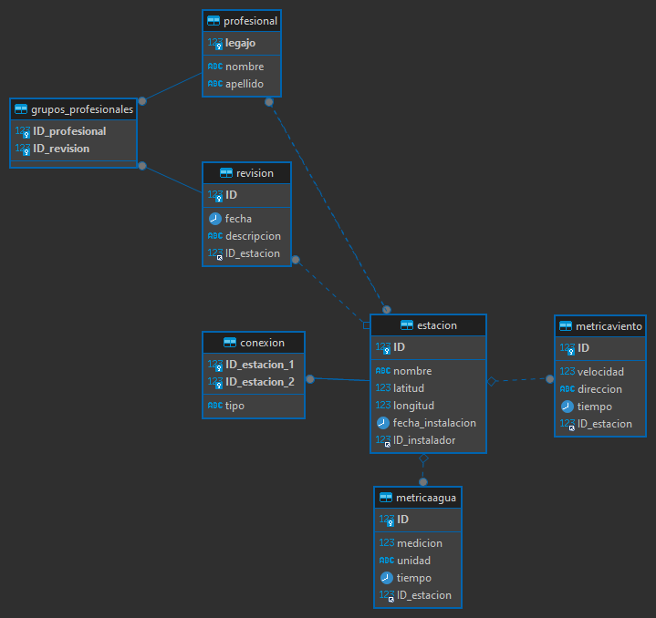
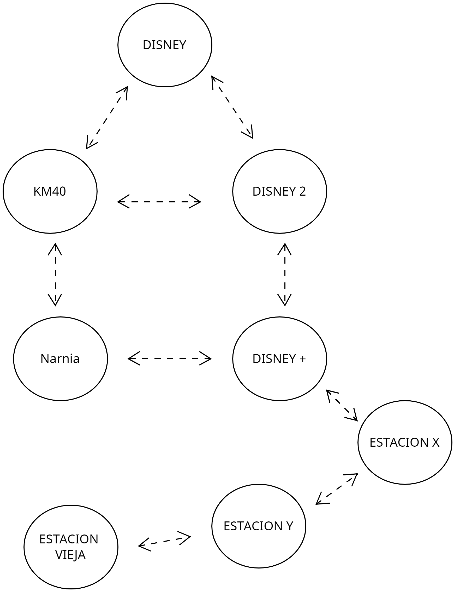
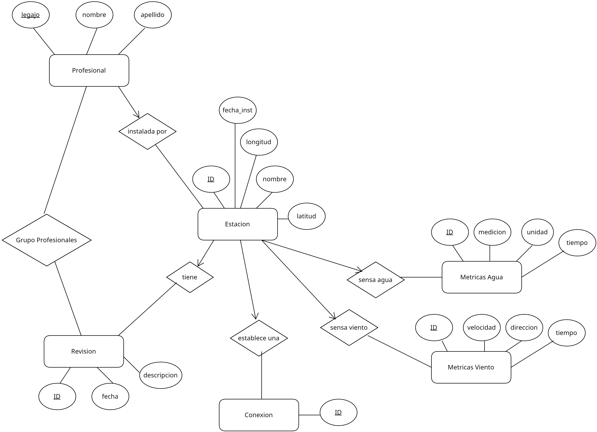

# Gestion de Red Estaciones Metereologicas en Python y MySQL

En este proyecto, se creó y diseñó una base de datos para una empresa
que realiza obras hídricas sobre el Río Colorado. La base de datos
incluye dos clases de sensores, uno para temperatura de agua y otro para velocidad del viento.
El de agua viene de dos tipos, uno que mide la temperatura en Kelvin y
otro el Celsius, en cambio, el de viento solamente mide en m/s y al
dirección en grados. Tanto el sensor de viento como el de agua se
encuentran distribuidos en boyas a lo largo del río, que llamaremos
"estaciones". La instalación de estas está dada por un profesional y el
mantenimiento y revisión de estas, por un grupo de profesionales.
Además, las estaciones están interconectadas entre sí de forma satélite
o por radio, formando así una red de conexiones. Nos interesa almacenar
toda esta información en la base de datos de forma que sea capaz de
realizar distintas operaciones.

# Desarrollo

La fase inicial del proyecto se centró en el análisis detallado de los
requisitos, seguido por la elaboración de un diagrama entidad-relación 
que sirve como guía fundamental para la implementación de la base de datos en SQL.

También se adjunta un pseudo diagrama que realiza DBeaver donde se
pueden ver las tablas adjuntas a cada entidad o relación:

Nos centramos en la creación de un sistema robusto que permitiera la
gestión eficiente de los datos meteorológicos recopilados. Se utilizó
SQL para diseñar una base de datos relacional que proporciona una
estructura organizada para el almacenamiento de información. Esta base
de datos fue elaborada con tablas específicas para cada tipo de dato,
asegurando coherencia y facilitando la realización de consultas
complejas.

Posteriormente, se desarrolló un programa en Python para interactuar con
la base de datos. El programa ofrece un conjunto de funciones que
permiten realizar consultas detalladas(las pedidas por la cátedra). La
integración de la programación en Python con la base de datos SQL
proporciona una herramienta ágil y potente para el análisis continuo.

En este proceso de desarrollo, se prestó especial atención a la
modularidad y la escalabilidad del código, permitiendo futuras
expansiones del proyecto con facilidad.

## Aclaraciones de código importantes 

La sinergia entre la base de datos y el programa en Python ha permitido
realizar consultas precisas, generar informes detallados y visualizar de
manera efectiva los patrones climáticos solicitados . La modularidad y
escalabilidad del programa aseguran que el sistema esté preparado para
adaptarse a futuras necesidades y expansiones del proyecto. A
continuación, se explican algunas funciones del sistema:

-   **Función Haversine**: Es importante tener en cuenta que para
    calcular la distancia entre una estación y otra (con las medidas de
    longitud y latitud) una forma utilizada a nivel mundial para
    encontrar con precisión dicha distancia es usando la función de
    *Haversine*, la cuál implementamos en SQL con la función *"create
    function"* para que el costo computacional de éste cálculo sea
    realizado por el motor de base de datos.

-   **Funciones de generar métricas:** Estos métodos implementan
    métricas aleatorias en fecha, desde la fecha de instalación de la
    estación hasta el día actual en la maquina donde se esta ejecutando
    el programa. Como también, son aleatorias en cuanto a las métricas,
    en el caso de el agua son aleatorias en unidad y en medición, y en
    el caso del viento en dirección y velocidad.

## Mejoras 

-   **Chequeo en el ingreso de fechas**:Esta modificación ayudará a
    evitar errores a la hora de registrar una fecha, pero se debe tener
    en cuenta que en el uso de esta base de datos, la carga de la fecha
    debe ser real y no una fecha fuera de rango.

-   **Interfaz gráfica**:La utilidad de la aplicación de consola creada
    existe y tiene un limite gráfico, tranquilamente se podrían crear
    consultas de datos y crear gráficos interesantes para el análisis de
    las estación. Para esto implementar en Python una interfaz gráfica
    es una excelente mejora, con librerías como Tkinter se podría lograr
    fácilmente.

-   **Complementar con mas clases el código:** El proyecto solo cuenta
    con la clase Base de Datos, dado que solo se cargan valores desde
    consola y se devuelven en ella. El uso de más clases como podría ser
    clase estación o clase revisión, sería interesante en el caso que la
    carga o muestra de estos datos no sea mediante consola. Podría
    hacerse una interfaz gráfica(como se mencionó anteriormente) o
    enviar lo obtenido a algún software el cual necesite determinados
    tipos de datos.

-   **Arreglar espacios vacíos:** En la ejecución del menú, cuando se
    añaden estaciones o revisiones a la base de datos hay aspectos como
    "nombre de la estación" o "añadir una conexión", con las opciones
    que se otorgan, el usuario puede dejar esa estación sin nombre o sin
    estaciones conectadas entre otras cosas. Podría mejorarse para que
    estas situaciones no ocurran.

# Pasos para una correcta ejecución

##  Ejecutar archivo SQL

En la carpeta contenedora del proyecto existe el archivo
*"proyecto.sql"* el cual cuenta con el código para generar la base de
datos y todas las tablas además de una función de SQL previamente
explicada. Es importante aclarar que se debe respetar el orden de
ejecución de este archivo para un correcto funcionamiento.

##  Realizar carga mínima de datos mediante DBeaver

Ahora es necesario cargar una cantidad de datos mínimos para ejecutar
por primera vez nuestro código, para esto se entrega el archivo
*"Entrega-Minima.sql"*. Este archivo cuenta con los *INSERT* mínimos
para ejecutar el programa, añade un mínimo de profesionales y además
estaciones con su respectivas conexiones. Esto ultimo se puede realizar
desde python. Igualmente recomendamos ejecutar estos últimos
*INSERT*(estación y conexión) para mantener un diagramado de conexiones
ya realizado para poder comparar lo obtenido con la figura de
conexionado que incluimos a continuación:

Para cumplir el conexionado base, ejecutar el archivo antes mencionado
en orden. En el caso de las revisiones se deben cargar desde python.

## Ejecutar programa en Python

Por ultimo ejecutar el archivo *\"main.py\"*, desde el terminal o desde
algún editor de código. Se recomienda antes de comenzar a realizar
alguna consulta, ejecutar la consulta que genera métricas
aleatorias(**Numero 4 en el menú**) para poder hacer consultas sobre
esas tablas.

**Todo preparado para usar el programa!**

{#fig:UML width="1\\linewidth"}

